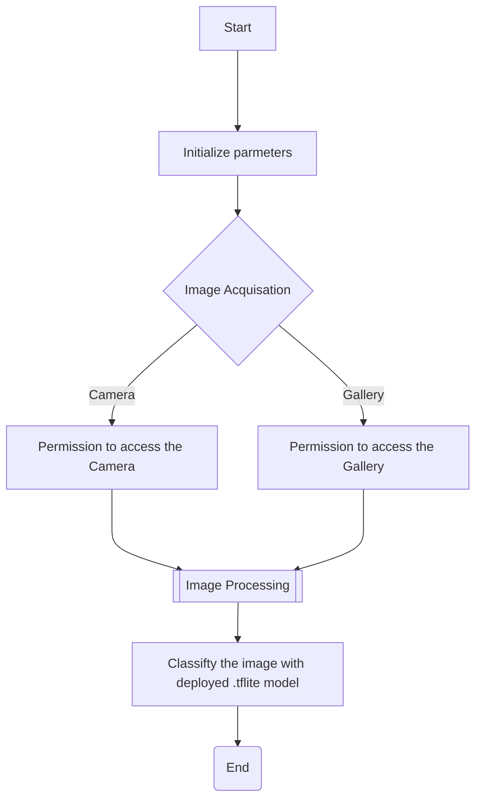

# ArrhythmiasClassifierApp

Four Types of Cardiac Arrhythmias : AF, NSR, PAC and PVC are assigned to classify by this app developed with Kotlin in Android Studio. This app is deployed with light weight deep learning neural network MobileNetV2. 

